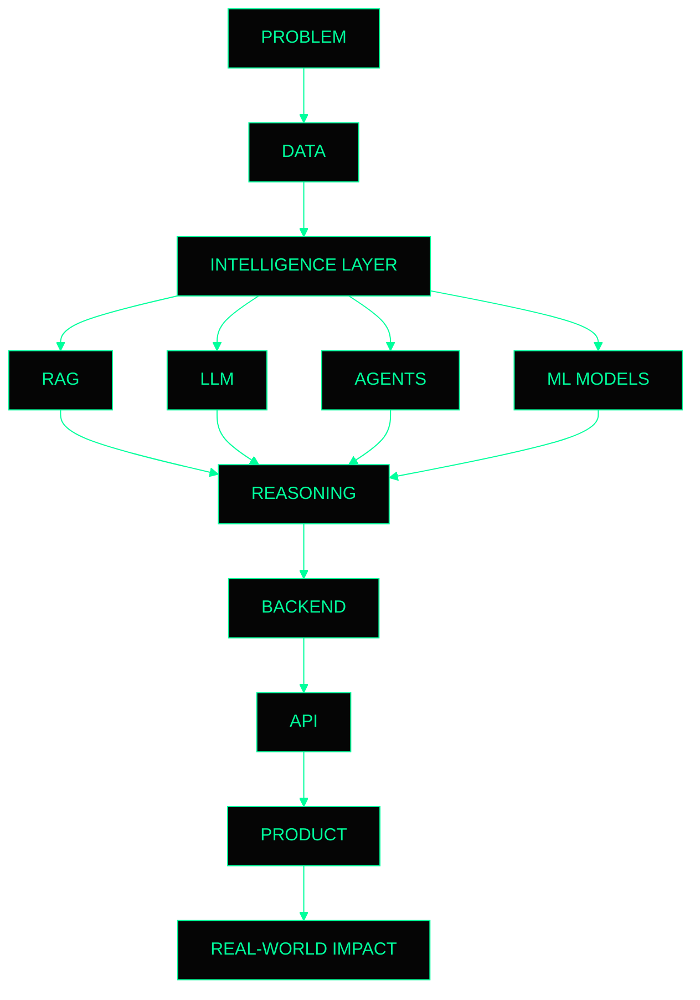
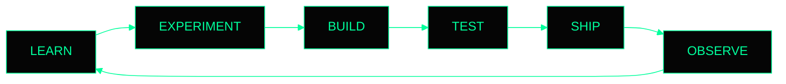
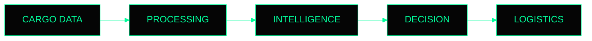
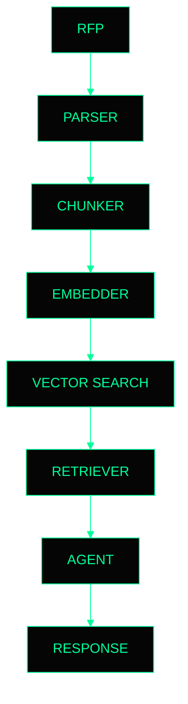
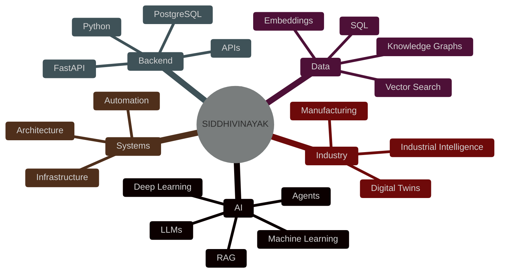

<div align="center">

# `siddhivinayak-ai`

```text
███████╗██╗██████╗ ██████╗ ██╗  ██╗██╗██╗   ██╗██╗███╗   ██╗ █████╗ ██╗   ██╗ █████╗ ██╗  ██╗
██╔════╝██║██╔══██╗██╔══██╗██║  ██║██║██║   ██║██║████╗  ██║██╔══██╗╚██╗ ██╔╝██╔══██╗██║ ██╔╝
███████╗██║██║  ██║██║  ██║███████║██║██║   ██║██║██╔██╗ ██║███████║ ╚████╔╝ ███████║█████╔╝
╚════██║██║██║  ██║██║  ██║██╔══██║██║╚██╗ ██╔╝██║██║╚██╗██║██╔══██║  ╚██╔╝  ██╔══██║██╔═██╗
███████║██║██████╔╝██████╔╝██║  ██║██║ ╚████╔╝ ██║██║ ╚████║██║  ██║   ██║   ██║  ██║██║  ██╗
╚══════╝╚═╝╚═════╝ ╚═════╝ ╚═╝  ╚═╝╚═╝  ╚═══╝  ╚═╝╚═╝  ╚═══╝╚═╝  ╚═╝   ╚═╝   ╚═╝  ╚═╝  ╚═╝
```

### `// AI × SYSTEMS × ENGINEERING`


<br>

`[ AI ]` `[ ML ]` `[ LLMs ]` `[ RAG ]` `[ BACKEND ]` `[ SYSTEMS ]`

</div>

---

## `01 // SYSTEM`

```text
┌──────────────────────────────────────────────────────────────────────┐
│                                                                      │
│   USER        siddhivinayak-ai                                      │
│   MODE        BUILD                                                 │
│   STATE       ONLINE                                                │
│                                                                      │
│   CORE        Artificial Intelligence                               │
│               Machine Learning                                      │
│               Backend Systems                                       │
│               Intelligent Automation                                │
│                                                                      │
│   PHILOSOPHY  BUILD → BREAK → LEARN → SHIP                         │
│                                                                      │
└──────────────────────────────────────────────────────────────────────┘
```

I build **intelligent software systems** around AI, data and automation.

My interests sit where these systems overlap:

```text
                 ┌─────────────────┐
                 │   INTELLIGENCE  │
                 └────────┬────────┘
                          │
            ┌─────────────┼─────────────┐
            ▼             ▼             ▼
        ┌───────┐     ┌───────┐     ┌──────────┐
        │  AI   │     │ DATA  │     │ SOFTWARE │
        └───┬───┘     └───┬───┘     └────┬─────┘
            │             │              │
            └─────────────┼──────────────┘
                          ▼
                 ┌─────────────────┐
                 │  REAL SYSTEMS   │
                 └─────────────────┘
```

---

# `02 // ARCHITECTURE`



---

# `03 // CURRENT OPERATIONS`



```text
BUILD STATUS

████████████████████████████████████████  100%

learning        [████████████████████]  CONTINUOUS
building        [████████████████████]  ACTIVE
experimenting   [██████████████████░░]  ACTIVE
shipping        [██████████████████░░]  ACTIVE
```

---

# `04 // PROJECTS`

## `PLACI`



`AI + DATA + BACKEND`

---

## `LAYOUT-AWARE RAG`

```mermaid
%%{init: {
  "theme": "dark",
  "themeVariables": {
    "primaryColor": "#050505",
    "primaryTextColor": "#00ff9c",
    "primaryBorderColor": "#00ff9c",
    "lineColor": "#00ff9c",
    "fontFamily": "JetBrains Mono"
  }
}}%%

flowchart LR

    A["PDF"] --> B["LAYOUT"]
    B --> C["TEXT + BLOCKS"]
    C --> D["EMBEDDINGS"]
    D --> E["VECTOR STORE"]
    E --> F["RETRIEVAL"]
    F --> G["CONTEXT"]
    G --> H["LLM"]

    style A fill:#050505,stroke:#00ff9c,color:#00ff9c
    style B fill:#050505,stroke:#00ff9c,color:#00ff9c
    style C fill:#050505,stroke:#00ff9c,color:#00ff9c
    style D fill:#050505,stroke:#00ff9c,color:#00ff9c
    style E fill:#050505,stroke:#00ff9c,color:#00ff9c
    style F fill:#050505,stroke:#00ff9c,color:#00ff9c
    style G fill:#050505,stroke:#00ff9c,color:#00ff9c
    style H fill:#050505,stroke:#00ff9c,color:#00ff9c
```



---

## `RFP INTELLIGENCE`



---

# `05 // TECHNOLOGY`

```text
┌─────────────────────────────────────────────────────────────┐
│                                                             │
│  LANGUAGE                                                   │
│  ├── Python                                                 │
│  ├── SQL                                                    │
│  ├── C++                                                    │
│  └── JavaScript                                             │
│                                                             │
│  AI / ML                                                    │
│  ├── PyTorch                                                │
│  ├── TensorFlow                                              │
│  ├── Scikit-learn                                            │
│  ├── Hugging Face                                            │
│  ├── Sentence Transformers                                   │
│  ├── Pandas / NumPy                                          │
│  └── ML Pipelines                                            │
│                                                             │
│  LLM SYSTEMS                                                │
│  ├── LangChain                                               │
│  ├── LangGraph                                               │
│  ├── RAG                                                      │
│  ├── Vector Search                                            │
│  ├── FAISS                                                    │
│  ├── ChromaDB                                                 │
│  └── Ollama                                                   │
│                                                             │
│  BACKEND                                                     │
│  ├── FastAPI                                                  │
│  ├── PostgreSQL                                               │
│  ├── MongoDB                                                  │
│  ├── SQLite                                                   │
│  └── REST APIs                                                │
│                                                             │
│  SYSTEMS                                                      │
│  ├── Git                                                      │
│  ├── Docker                                                   │
│  ├── Linux                                                    │
│  └── Cloud Deployment                                         │
│                                                             │
└─────────────────────────────────────────────────────────────┘
```

---

# `06 // SYSTEM MAP`



---

# `07 // GITHUB TELEMETRY`

<div align="center">


</div>

---

# `08 // ACTIVITY`

<div align="center">


</div>

---

# `09 // CONTRIBUTION MATRIX`

<div align="center">


</div>

---

# `10 // CURRENTLY.EXPLORING`


---

# `11 // PRINCIPLES`

```text
01  BUILD > TALK

02  PROBLEM > TECHNOLOGY

03  SIMPLE > COMPLEX

04  SYSTEM > DEMO

05  INTELLIGENCE > AUTOMATION

06  SHIP → OBSERVE → IMPROVE → REPEAT
```

---

# `12 // TERMINAL`

```text
┌──────────────────────────────────────────────────────────────┐
│                                                              │
│  siddhivinayak@github:~$ ./build                             │
│                                                              │
│  [✓] loading intelligence layer                             │
│  [✓] initializing models                                    │
│  [✓] connecting data layer                                  │
│  [✓] initializing agents                                    │
│  [✓] compiling ideas                                        │
│  [✓] deploying experiments                                  │
│                                                              │
│  STATUS: OPERATIONAL                                        │
│                                                              │
│  siddhivinayak@github:~$ _                                   │
│                                                              │
└──────────────────────────────────────────────────────────────┘
```

<div align="center">

### `// BUILD. BREAK. LEARN. SHIP.`


</div>
